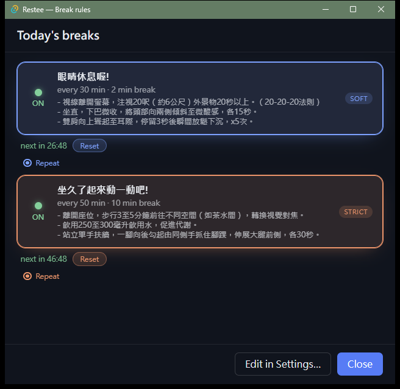
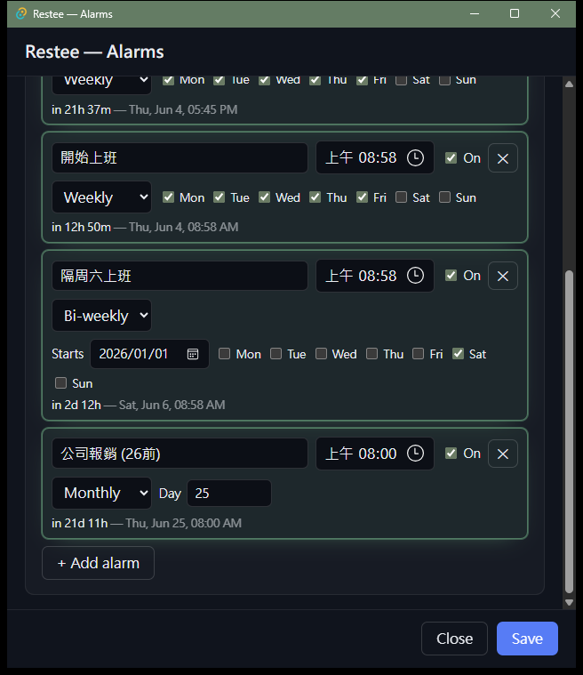
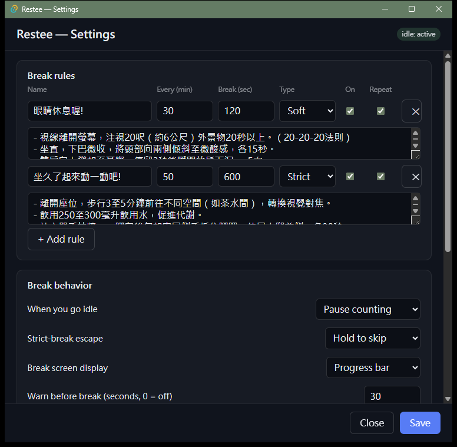

# restee

A cross-platform, tray-resident **break reminder for engineers** — and a lightweight
**clock-alarm** tool. It nudges you to rest your eyes and step away on customizable
intervals (gentle *soft* breaks, or screen-covering *strict* breaks when you need a firmer
push), and can fire wall-clock alarms (daily, weekly, bi-weekly, …) right alongside.

Built with **Tauri v2** (Rust core + TypeScript/HTML/CSS UI): tiny binaries, low idle RAM
(~tens of MB), no Electron.

## Screenshots

<p align="center">
  
  &nbsp;&nbsp;
  
  &nbsp;&nbsp;
  
  <br>
  <sub><b>Break-rules dashboard</b> &nbsp;·&nbsp; <b>Alarms</b> (incl. bi-weekly) &nbsp;·&nbsp; <b>Settings</b></sub>
</p>

## Features

- **Break rules** — any number, each with its own interval, break duration, and enforcement
  (soft / strict). A rule can **repeat** or fire **once** (then it auto-disables). Each rule
  can carry an optional multi-line note shown on the break screen. Edit them in the full
  **Settings** grid, or flip them on/off fast from the standalone **Break-rules dashboard**
  (*Breaks…* in the tray) — big cards with On/Off and Repeat/Once toggles that save and
  reconfigure the running timer live.
- **Clock alarms** — name + time + recurrence: **Once, Daily, Weekly, Bi-weekly, Monthly,
  Yearly**. Weekly and Bi-weekly let you pick weekdays; bi-weekly fires every *other* week
  from a start date; monthly clamps to the month's last day; yearly is month + day. Alarms
  ring with a distinct tone and a notification — even while the break timer is paused or a
  break is on screen — but only while Restee is running (no catch-up for missed minutes).
  Managed in their own **Alarms** window.
- **Two enforcement tiers** — *soft* (calm, skippable full-screen overlay + chime + optional
  notification) and *strict* (opaque cover on **all monitors**). Strict breaks honor a
  configurable escape: **hold-to-skip**, **easy** one-click skip, or **no easy escape**.
- **Heads-up warning** — an optional, non-focus-stealing countdown toast a few seconds before
  a break starts (configurable; `0` = off).
- **Activity-aware** — auto-pauses while you're idle. The default *pause* policy just freezes
  the countdown; the *credit* policy instead **credits** time away as a completed break so it
  doesn't nag the moment you return.
- **Your choice of break display** — a large `MM:SS` countdown, or a draining progress bar.
- **Safety floor** — strict breaks always auto-release at the end, and a hidden hold-Esc
  emergency exit means you can never be truly locked out.
- **Tray-resident** — no main window. *Start / Pause*, *Reset break timer*, *Break now*,
  *Breaks…*, *Alarms…*, *Settings…*, *Language*, *Quit* — all from the tray icon, which also
  shows a live per-rule countdown. Optional global hotkeys for toggle / break-now / skip.
- **Localized** — ships **Traditional Chinese (default)** and **English**, switched from the
  tray's *Language* menu.
- **Launch at login**, single-instance, self-healing TOML config.

> **Honest limitation:** a *truly* unescapable lockout is impossible (the OS always
> reserves Ctrl+Alt+Del, Cmd+Opt+Esc, etc.). Strict breaks are a forceful screen *cover*,
> not an OS-level lock.

## Requirements

- [Rust](https://rustup.rs/) (stable) and [Node.js](https://nodejs.org/) 18+.
- Platform webview: Windows has WebView2 preinstalled; macOS uses WKWebView; Linux
  needs `webkit2gtk` (see Tauri's [prerequisites](https://v2.tauri.app/start/prerequisites/)).

## Develop

```bash
npm install
npm run tauri dev
```

The app starts in the system tray (no window). Use **tray → Break now** to preview a
break, **tray → Breaks…** to toggle rules, or **tray → Settings…** to edit everything.

Handy test hooks (env vars, debug builds):
- `RESTEE_BREAK_ON_START=1` — fire a break ~2s after launch.
- `RESTEE_OPEN_SETTINGS=1` — open the settings window on launch.
- `RESTEE_OPEN_ALARMS=1` — open the alarms window on launch.
- `RESTEE_NO_OPEN_RULES=1` — suppress the break-rules window that otherwise opens on every launch.

## Test

```bash
cargo test -p restee-core     # pure engine + config + alarm-recurrence unit/property tests
cargo clippy --workspace --all-targets
```

The timing/priority/idle logic and the alarm-recurrence matcher live in the dependency-free
`restee-core` crate, so they test in well under a second without compiling Tauri.

## Package

```bash
npm run tauri build
```

Produces installers under `target/release/bundle/` (workspace-root `target/`, not under
`src-tauri/`):
- **Windows** — `msi/` (WiX) and `nsis/` (`.exe` setup).
- **macOS** — `dmg/` + `macos/*.app` (build on macOS).
- **Linux** — `deb/`, `rpm/`, `appimage/` (build on Linux; AppImage is the most
  portable, and most reliable for the tray).

Cross-platform installers are produced automatically in CI — see
[`.github/workflows/release.yml`](.github/workflows/release.yml).

### Run a release binary without bundling

To produce a standalone, runnable binary (no installers) — e.g. for quick local
testing:

```bash
cargo build --release --features custom-protocol   # → target/release/restee[.exe]
```

> **Do not** build a runnable app with a bare `cargo build`/`cargo build --release`.
> Without the `custom-protocol` feature, Tauri compiles the app in **dev mode**, so
> every window tries to load the frontend from the Vite dev server
> (`http://localhost:1420`). With no dev server running you get a blank window /
> `ERR_CONNECTION_REFUSED`. `npm run tauri dev` and `npm run tauri build` enable the
> feature automatically; a plain `cargo build` does not.

### Signing (follow-up)

Builds are currently **unsigned**. For distribution:
- **Windows** — sign the installer with an Authenticode certificate.
- **macOS** — code-sign + notarize (required for Gatekeeper; also for any future
  input-suppression features). Windows toast notifications also render most
  reliably once the app is installed with a proper app identity.

## Configuration

All state lives in a single, self-healing TOML file in the OS config dir:

- **Windows** — `%APPDATA%\com.restee.app\config.toml`
- **macOS** — `~/Library/Application Support/com.restee.app/config.toml`
- **Linux** — `~/.config/com.restee.app/config.toml`

It holds the settings, break **rules**, and **alarms** (plus the chosen language). Edit it
in-app via **Settings / Breaks… / Alarms…**, or by hand. A corrupt file is backed up
(`config.toml.bak`) and defaults are restored. The shipped defaults are the embedded
[`crates/restee-core/default_config.toml`](crates/restee-core/default_config.toml).

## Project layout

```
crates/restee-core/  # pure engine + config DTOs + alarm recurrence (no Tauri/OS deps); ships default_config.toml
src/                 # frontend (Vite, vanilla TS): index.html (Settings), rules.html (Break-rules dashboard),
                     #   alarms.html (Alarms), overlay.html (break screen), toast.html (pre-break toast); shared rule-editor.ts
src-tauri/           # Tauri host: tray, idle, overlays, hotkeys, autostart, audio, notifications, alarm scheduler
```

The dependency-free Rust core decides *when* to break (and whether an alarm is due); the
Tauri layer turns those decisions into windows, sounds, notifications, and tray UI.
