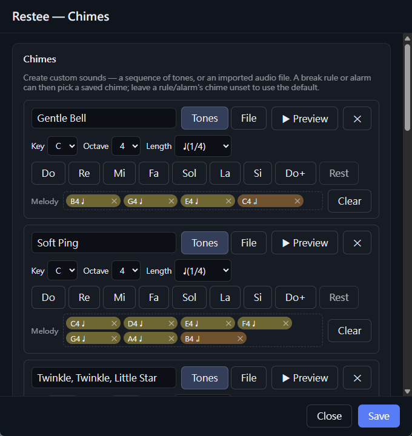

# gomaju

> 語言 / Language：**繁體中文** ｜ [English](#english)

Gomaju是台語「顧目睭」、照顧眼睛的意思，這是一款跨平台、常駐在系統匣的**工程師休息提醒工具**，順手也能拿來當**時鐘鬧鐘**。它會照你設定的間隔，提醒你讓眼睛歇一下、起來走動走動 — 可以是溫和、按一下就略過的*軟性*休息；需要更狠一點的時候，也能用蓋住整個螢幕的*強制*休息把你從螢幕前拉開。順帶一提，它也能照實際時間響鬧鐘（每天、每週、每兩週……都行）。

用 **Tauri v2** 做的（Rust 核心 + TypeScript/HTML/CSS 介面），所以執行檔很小、閒置時也只吃幾十 MB 記憶體，而且完全沒用到 Electron。

## 螢幕截圖

<p align="center">
  
  &nbsp;&nbsp;
  
  &nbsp;&nbsp;
  
  &nbsp;&nbsp;
  
  <br>
  <sub><b>休息規則儀表板</b> &nbsp;·&nbsp; <b>鬧鐘</b>（含每兩週） &nbsp;·&nbsp; <b>設定</b></sub>
</p>

## 功能特色

- **休息規則** — 想設幾條都行，每條都有自己的間隔、要休息多久、還有強度（軟性／強制）。規則可以**一直重複**，也可以只響**一次**（響完就自動關掉）。每條還能寫一段備註（可以多行），休息的時候就顯示在畫面上。要細調就到完整的**設定**表格裡改；想快速開開關關，就用獨立的**休息規則儀表板**（系統匣的 *Breaks…*）— 一張張大卡片，點一下切 開／關 跟 重複／單次，存檔後馬上套到正在跑的計時器上。

- **時鐘鬧鐘** — 給它名稱 + 時間 + 重複方式：**單次、每日、每週、每兩週、每月、每年**。每週、每兩週可以勾要哪幾天；每兩週是從你指定的那一週開始、每隔一週響一次；每月碰到沒有的日子（像 31 號）會自動改成當月最後一天；每年就看月 + 日。時間一到就用一個特別的音效加通知提醒你 — 就算休息計時器暫停了、或正在休息中，照樣會響 — 不過只有 Gomaju 開著的時候才算數（沒開的那段時間錯過就錯過，不會補響）。這些通通在專屬的**鬧鐘**視窗裡管。

- **倒數計時器** — 跟休息、鬧鐘各自獨立的另一套小工具。在**計時器**視窗（系統匣的 *Timers…*）裡建一堆可以重複使用的預設（從幾秒到 `99:59:59`），按一下就開始倒數，時間到就用鈴聲加通知提醒你（只響一次）。有個全域開關可以讓所有計時器**倒數**歸零、或反過來**正數**數到你設的長度；要的話右下角還會跳一個即時的小視窗幫你盯著。**時間到之後它不會就這樣消失，而是繼續往下數** — 倒數的會穿過零變負的（`-00:12`），正數的則從零重新開始（`+00:16`） — 用紅字配上一行「時間到！」顯示，直到你把它關掉。即時小視窗有開的時候，它就是唯一的提醒（歸零那一刻自己響鈴），系統通知就讓給它、不再重複跳；沒開的話才改用系統通知加鈴聲，再外加一個會一直留著的「時間到！」小視窗。

- **碼錶** — 又一個各自獨立的小工具。在**碼錶**視窗（系統匣的 *Stopwatch…*）裡開始計時，精準到百分之一秒（最長 `99:59:59.99`），隨手就能記下分段（Lap），開始／暫停／重設都行，空白鍵還能快速開始／暫停。開始或暫停的時候可以選擇要不要「嗶」一聲提醒（在**設定 → 碼錶**裡開關、調音量）。

- **兩種強度** — *軟性*：溫和、隨時可以略過的全螢幕畫面，加上提示音和（可選的）通知；*強制*：把**每一個螢幕**都用不透明的畫面蓋住。強制休息要怎麼脫身也能自己挑：**長按才放你走**、**一鍵輕鬆略過**，或者乾脆**不留輕鬆的後門**。

- **自訂提示音** — 在**鈴聲**視窗（系統匣的 *Chimes…*）做你自己的休息和鬧鐘音效：可以用音符**自己編一段旋律**（C／G／F 大調的 Do-Re-Mi，還能調八度跟音長），或乾脆**匯入音檔**（wav／mp3／ogg／flac）。一邊做一邊聽（▶ 預覽 ⇄ ⏸ 暫停；每加一個音符也會立刻發聲，旋律裡的音符點一下也能再聽一次），音符還能拖來拖去重新排。編好之後，每條休息規則可以各自挑**開始**跟**結束**的鈴聲，每個鬧鐘也能挑自己的，音量還能一個一個設 — 沒特別設就用內建的預設音。存好的鈴聲都放在各自的 `chimes.toml` 裡。

- **休息小語** — 休息畫面可以顯示一句勵志小語，系統已經內建，你也可以自己新增編輯。每次隨機挑一句，而且**分語言**（繁體中文、英文各一份清單）。這些都能在**設定 → 語錄**卡片裡編，也能關掉不要顯示。

- **休息前提醒** — 休息開始前幾秒，會先跳一個不搶焦點的小倒數（要提前幾秒可以自己設；填 `0` 就是不要）。也可以在倒數時臨時延後休息1分鐘。

- **會看你有沒有在用** — 你人離開、閒置的時候會自動暫停。預設的*暫停*作法只是把倒數先停住；改成*計入*的話，會把你離開的那段時間**當成已經休息過了**，這樣你一回來才不會馬上又被叫去休息。

- **系統匣圖示** — 沒有主視窗。*開始／暫停*、*重設休息計時器*、*立即休息*、*Breaks…*、*Alarms…*、*Timers…*、*Stopwatch…*、*Settings…*、*結束* — 通通從系統匣那顆圖示點開來用，圖示上也會即時顯示每條規則還剩多久。要的話也能自己設全域快捷鍵來 切換／立即休息／略過。

- **雙語介面** — 內建**繁體中文（預設）**跟**英文**，在**設定**裡就能切。

- **開機自動啟動**、同一時間只會跑一個、以及壞了會自己修好的 TOML 設定檔。

## 系統需求

- [Rust](https://rustup.rs/)（stable）跟 [Node.js](https://nodejs.org/) 18+。
- 系統的 webview：Windows 本來就裝好 WebView2 了；macOS 用的是 WKWebView；Linux 要自己裝 `webkit2gtk`（細節看 Tauri 的[前置需求](https://v2.tauri.app/start/prerequisites/)）。

## 開發

```bash
npm install
npm run tauri dev
```

App 會直接縮在系統匣裡（不會跳視窗）。想看看休息長怎樣就點**系統匣 → Break now**、要開關規則就點**系統匣 → Breaks…**，所有設定則在**系統匣 → Settings…** 裡面。

幾個測試很方便的小開關（環境變數，只有 debug build 才有）：
- `GOMAJU_BREAK_ON_START=1` — 啟動後大約 2 秒就先跳一次休息。
- `GOMAJU_OPEN_SETTINGS=1` — 一啟動就把設定視窗打開。
- `GOMAJU_OPEN_ALARMS=1` — 一啟動就把鬧鐘視窗打開。
- `GOMAJU_OPEN_TIMERS=1` — 一啟動就把計時器視窗打開。
- `GOMAJU_NO_OPEN_RULES=1` — 本來每次啟動都會跳出休息規則視窗，設了這個就不跳。

## 測試

```bash
cargo test -p gomaju-core     # 純引擎 + 設定 + 鬧鐘週期的單元／屬性測試
cargo clippy --workspace --all-targets
```

計時、優先序、閒置這些邏輯，加上鬧鐘的週期判斷，全都放在不依賴任何外部套件的 `gomaju-core` crate 裡，所以根本不用編譯 Tauri，一秒不到就測完了。

## 從原始碼建置

要發哪個系統的版本，就在那個系統上建 — Tauri 打包的是各平台的**原生**安裝程式，所以你沒辦法在 macOS 上做出 Windows 的 `.exe`（反過來也一樣）。想一次把所有平台都建好的話，交給 CI 就行 — 見 [`.github/workflows/release.yml`](.github/workflows/release.yml)。

所有產出都會放在 `target/release/bundle/` 底下（注意是工作區根目錄那個 `target/`，**不是** `src-tauri/` 裡面的那個）。

### 前置需求

除了上面[系統需求](#系統需求)那些（Rust stable + Node 18+；CI 跑的是 Node 20）以外，還要：

- **Windows** — [Microsoft C++ Build Tools](https://visualstudio.microsoft.com/visual-cpp-build-tools/)（裝 *Desktop development with C++* 那個工作負載），給 Rust 的 MSVC 工具鏈用。Windows 10/11 本來就有 WebView2 了。
- **macOS** — Xcode Command Line Tools：`xcode-select --install`。如果要做跨架構或通用（universal）的版本，記得補上 Rust 目標：`rustup target add aarch64-apple-darwin x86_64-apple-darwin`。
- **Linux** — `webkit2gtk` 那一票套件（就是 [`release.yml`](.github/workflows/release.yml) 裡列的那些 `apt` 套件）。

接著前端的相依套件裝一次就好：`npm install`。

### 版本管理

app 版本以 `package.json` 為準。用下面這個指令，就能讓 Tauri 跟 Cargo 那邊的版本資訊一起跟著對齊：

```bash
npm run version:set -- 0.2.0
```

`npm run build` 在產生 `dist/` 之前，會先檢查 `package.json`、`src-tauri/tauri.conf.json`、`src-tauri/Cargo.toml` 這三個的版本有沒有對上。

### 在 Windows 建置

```powershell
npm run tauri build
```

安裝程式會放在 `target\release\bundle\`：

- `msi\` — WiX 包的安裝程式，例如 `Gomaju_0.1.0_x64_en-US.msi`
- `nsis\` — NSIS 的安裝 `.exe`，例如 `Gomaju_0.1.0_x64-setup.exe`

如果你想要那種免安裝、點兩下就跑的檔案，往下看「獨立執行檔（免安裝）」。

### 在 macOS 建置

```bash
npm run tauri build                                       # 主機架構
npm run tauri build -- --target universal-apple-darwin    # 通用（需兩個 Rust 目標）
# 單一架構：--target aarch64-apple-darwin | --target x86_64-apple-darwin
```

產出會是：`macos/Gomaju.app` 加上 `dmg/Gomaju_<ver>_<arch>.dmg`。

這個版本**沒有簽章**，所以直接雙擊會被 Gatekeeper 擋下來。改成對著 app 按右鍵 → **打開**（確認一次就好），或者把隔離旗標清掉：

```bash
xattr -dr com.apple.quarantine /path/to/Gomaju.app
```

### 在 Linux 建置

```bash
npm run tauri build   # 先安裝上方前置需求中的 apt 套件
```

會做出 `deb/`、`rpm/`、`appimage/` 這幾種（其中 AppImage 最好帶著走，系統匣也是它跑起來最穩）。

### 獨立執行檔（免安裝）

想要一個免安裝、直接點下去就能跑的執行檔（本機測試很方便）：

```bash
cargo build --release --features custom-protocol   # → target/release/gomaju.exe（Windows）| gomaju（macOS/Linux）
```

> **千萬不要**直接拿 `cargo build`／`cargo build --release` 去建可執行的 app。
> 少了 `custom-protocol` 這個 feature，Tauri 會用 **dev 模式**編譯，結果每個視窗都會跑去 Vite 開發伺服器（`http://localhost:1420`）抓前端 — 開發伺服器沒開的話，你看到的就是一片空白視窗／`ERR_CONNECTION_REFUSED`。`npm run tauri dev` 跟 `npm run tauri build` 會自動幫你開這個 feature；單純 `cargo build` 不會。

它會直接沿用現成的 `dist/`；要是你動過 `src/` 裡的東西，記得先 `npm run build` 重新產一份。在 **Windows** 上，建置之前先把還在跑的那個關掉 — 因為系統匣 app 跑著的時候會把執行檔鎖住，不然建置會以 `Access denied (os error 5)` 失敗：

```powershell
Stop-Process -Name gomaju -Force
```

### 簽署（後續）

目前的版本都**還沒簽章**。之後要正式發佈的話：
- **Windows** — 用 Authenticode 憑證把安裝程式簽起來。
- **macOS** — 程式碼簽章 + 公證（要過 Gatekeeper 一定要，將來想做輸入抑制之類的功能也會用到）。另外 Windows 的快顯通知，也是要等 app 用正式身分安裝之後，才最會乖乖出現。

## 設定

所有狀態都存在作業系統設定目錄裡的一個 TOML 檔，而且這個檔壞了還會自己修好：

- **Windows** — `%APPDATA%\com.gomaju.app\config.toml`
- **macOS** — `~/Library/Application Support/com.gomaju.app/config.toml`
- **Linux** — `~/.config/com.gomaju.app/config.toml`

裡面放的是各種設定、休息**規則**、**鬧鐘**（還有你選的語言）。你可以在 app 裡用 **Settings／Breaks…／Alarms…** 改，也可以直接手動編。萬一檔案壞了，它會先備份一份（`config.toml.bak`）再還原成預設值；而預設值就是內建的那份 [`crates/gomaju-core/default_config.toml`](crates/gomaju-core/default_config.toml)。

另外有兩樣東西不放在 `config.toml` 裡，而是擺在它**隔壁**各自的檔案（第一次跑的時候會建好，之後隨時可以改）：

- **存好的鈴聲** — `chimes/chimes.toml`（跟你匯入的音檔放在一起），在 **Chimes…** 視窗裡編。規則和鬧鐘是靠 `config.toml` 裡的 id 去對應到某個鈴聲。
- **休息小語** — `quotes.<locale>.txt`（`quotes.en.txt`／`quotes.zh-Hant.txt`），在 **設定 → 語錄**卡片裡編；休息畫面會從你目前語言的那份清單裡抽。

## 專案結構

```
crates/gomaju-core/  # 純引擎 + 設定 DTO + 鬧鐘週期（無 Tauri/OS 相依）；隨附 default_config.toml
src/                 # 前端（Vite，原生 TS）：index.html（設定）、breaks.html（休息規則儀表板）、
                     #   alarms.html（鬧鐘）、chimes.html（鈴聲編輯器）、overlay.html（休息畫面）、toast.html
                     #   （休息前提示）；共用 rule-editor.ts / notes.ts / quotes-editor.ts
src-tauri/           # Tauri 主程式：系統匣、閒置、覆蓋層、快捷鍵、開機自啟、音訊、通知、鬧鐘排程器
```

那個不依賴外部套件的 Rust 核心，負責決定*什麼時候*該休息（還有鬧鐘到了沒）；Tauri 層則把這些決定變成實際的視窗、聲音、通知和系統匣介面。

---

<a id="english"></a>

# gomaju

Gomaju is the Taiwanese word for "顧目睭" (kòo ba̍k-tsiu), meaning to take care of one's eyes. Gomaju is a cross-platform, tray-resident **break reminder for engineers** — and a lightweight
**clock-alarm** tool. It nudges you to rest your eyes and step away on customizable
intervals (gentle *soft* breaks, or screen-covering *strict* breaks when you need a firmer
push), and can fire wall-clock alarms (daily, weekly, bi-weekly, …) right alongside.

Built with **Tauri v2** (Rust core + TypeScript/HTML/CSS UI): tiny binaries, low idle RAM
(~tens of MB), no Electron.

## Screenshots

<p align="center">
  
  &nbsp;&nbsp;
  
  &nbsp;&nbsp;
  
  &nbsp;&nbsp;
  
  <br>
  <sub><b>Break-rules dashboard</b> &nbsp;·&nbsp; <b>Alarms</b> (incl. bi-weekly) &nbsp;·&nbsp; <b>Settings</b></sub>
</p>

## Features

- **Break rules** — any number, each with its own interval, break duration, and enforcement
  (soft / strict). A rule can **repeat** or fire **once** (then it auto-disables). Each rule
  can carry an optional multi-line note shown on the break screen. Edit them in the full
  **Settings** grid, or flip them on/off fast from the standalone **Break-rules dashboard**
  (*Breaks…* in the tray) — big cards with On/Off and Repeat/Once toggles that save and
  reconfigure the running timer live.
- **Clock alarms** — name + time + recurrence: **Once, Daily, Weekly, Bi-weekly, Monthly,
  Yearly**. Weekly and Bi-weekly let you pick weekdays; bi-weekly fires every *other* week
  from a start date; monthly clamps to the month's last day; yearly is month + day. Alarms
  ring with a distinct tone and a notification — even while the break timer is paused or a
  break is on screen — but only while Gomaju is running (no catch-up for missed minutes).
  Managed in their own **Alarms** window.
- **Countdown timers** — a separate tool from breaks and alarms. Build reusable presets (a few
  seconds up to `99:59:59`) in the **Timers** window (*Timers…* in the tray); one tap starts the
  countdown, which fires once with a chime + notification. A global toggle counts every timer
  **down** to zero or **up** to its duration, and an optional live toast tracks the running timer
  bottom-right. **When a timer finishes it keeps counting overtime** instead of vanishing — a
  countdown ticks past zero into the negative (`-00:12`), a count-up restarts from zero (`+00:16`) —
  shown in red with a "Time's up!" note until you dismiss it. With the live toast on, that toast is
  the sole finish cue (it sounds the chime the moment it hits zero, and the redundant OS
  notification is suppressed); with it off, you get the OS notification + chime plus a persistent
  "Time's up!" toast.
- **Stopwatch** — yet another standalone tool. Time things to a hundredth of a second
  (up to `99:59:59.99`) in the **Stopwatch** window (*Stopwatch…* in the tray), with lap
  splits, start / pause / reset, and spacebar to start/pause. An optional beep marks each
  start/pause — toggle it on/off and set its volume in **Settings → Stopwatch**.
- **Two enforcement tiers** — *soft* (calm, skippable full-screen overlay + chime + optional
  notification) and *strict* (opaque cover on **all monitors**). Strict breaks honor a
  configurable escape: **hold-to-skip**, **easy** one-click skip, or **no easy escape**.
- **Custom chimes** — craft your own break and alarm sounds in the **Chimes** window
  (open it from **Settings → Open chime editor**): **compose a melody** from musical notes (Do-Re-Mi in C / G / F major,
  with octave and note length) or **import an audio file** (wav / mp3 / ogg / flac). Preview as you go
  (▶ Preview ⇄ ⏸ Pause; each note sounds as you add it, and click any note in the melody
  to hear it again) and drag notes to reorder. Then each break rule can pick a **start** and an **end**
  chime, and each alarm its own, with volume set per selection — leave it unset to use the built-in
  default tones. Saved presets live in their own `chimes.toml`.
- **Heads-up warning** — an optional, non-focus-stealing countdown toast a few seconds before
  a break starts (configurable; `0` = off).
- **Activity-aware** — auto-pauses while you're idle. The default *pause* policy just freezes
  the countdown; the *credit* policy instead **credits** time away as a completed break so it
  doesn't nag the moment you return.
- **Your choice of break display** — a large `MM:SS` countdown, or a draining progress bar.
- **Break quotes** — optionally show an inspirational quote on the break screen, picked at
  random each break and **localized** (separate Traditional Chinese / English lists). Edit them,
  and toggle them on/off, in the **Settings → Quotes** card.
- **Safety floor** — strict breaks always auto-release at the end, and a hidden hold-Esc
  emergency exit means you can never be truly locked out.
- **Tray-resident** — no main window. *Start / Pause*, *Reset break timer*, *Break now*,
  *Breaks…*, *Alarms…*, *Timers…*, *Stopwatch…*, *Settings…*, *Quit* — all from the tray icon, which
  also shows a live per-rule countdown. Optional global hotkeys for toggle / break-now / skip.
- **Localized** — ships **Traditional Chinese (default)** and **English**, switched from the
  **Settings** window.
- **Launch at login**, single-instance, self-healing TOML config.

> **Honest limitation:** a *truly* unescapable lockout is impossible (the OS always
> reserves Ctrl+Alt+Del, Cmd+Opt+Esc, etc.). Strict breaks are a forceful screen *cover*,
> not an OS-level lock.

## Requirements

- [Rust](https://rustup.rs/) (stable) and [Node.js](https://nodejs.org/) 18+.
- Platform webview: Windows has WebView2 preinstalled; macOS uses WKWebView; Linux
  needs `webkit2gtk` (see Tauri's [prerequisites](https://v2.tauri.app/start/prerequisites/)).

## Develop

```bash
npm install
npm run tauri dev
```

The app starts in the system tray (no window). Use **tray → Break now** to preview a
break, **tray → Breaks…** to toggle rules, or **tray → Settings…** to edit everything.

Handy test hooks (env vars, debug builds):
- `GOMAJU_BREAK_ON_START=1` — fire a break ~2s after launch.
- `GOMAJU_OPEN_SETTINGS=1` — open the settings window on launch.
- `GOMAJU_OPEN_ALARMS=1` — open the alarms window on launch.
- `GOMAJU_OPEN_TIMERS=1` — open the timers window on launch.
- `GOMAJU_NO_OPEN_RULES=1` — suppress the break-rules window that otherwise opens on every launch.

## Test

```bash
cargo test -p gomaju-core     # pure engine + config + alarm-recurrence unit/property tests
cargo clippy --workspace --all-targets
```

The timing/priority/idle logic and the alarm-recurrence matcher live in the dependency-free
`gomaju-core` crate, so they test in well under a second without compiling Tauri.

## Build from source

Build on the OS you're targeting — Tauri bundles **native** installers per platform, so you
can't cross-build a Windows `.exe` on macOS (or vice-versa). CI builds every platform at once —
see [`.github/workflows/release.yml`](.github/workflows/release.yml).

All bundles land under `target/release/bundle/` (the workspace-root `target/`, **not** under
`src-tauri/`).

### Prerequisites

In addition to the [Requirements](#requirements) above (Rust stable + Node 18+; CI uses Node 20):

- **Windows** — [Microsoft C++ Build Tools](https://visualstudio.microsoft.com/visual-cpp-build-tools/)
  (the *Desktop development with C++* workload) for Rust's MSVC toolchain. WebView2 is preinstalled
  on Windows 10/11.
- **macOS** — Xcode Command Line Tools: `xcode-select --install`. For a cross-arch or universal
  build, add the Rust targets: `rustup target add aarch64-apple-darwin x86_64-apple-darwin`.
- **Linux** — `webkit2gtk` and friends (the `apt` packages listed in
  [`release.yml`](.github/workflows/release.yml)).

Then install the frontend dependencies once: `npm install`.

### Versioning

`package.json` is the canonical app version. Keep Tauri and Cargo metadata aligned with:

```bash
npm run version:set -- 0.2.0
```

`npm run build` checks that `package.json`, `src-tauri/tauri.conf.json`, and
`src-tauri/Cargo.toml` all use the same version before producing `dist/`.

### Build for Windows

```powershell
npm run tauri build
```

Installers land under `target\release\bundle\`:

- `msi\` — WiX installer, e.g. `Gomaju_0.1.0_x64_en-US.msi`
- `nsis\` — NSIS setup `.exe`, e.g. `Gomaju_0.1.0_x64-setup.exe`

For a no-installer binary, see [Standalone binary](#standalone-binary-no-installer) below.

### Build for macOS

```bash
npm run tauri build                                       # host architecture
npm run tauri build -- --target universal-apple-darwin    # universal (needs both Rust targets)
# single arch: --target aarch64-apple-darwin | --target x86_64-apple-darwin
```

Output: `macos/Gomaju.app` + `dmg/Gomaju_<ver>_<arch>.dmg`.

The build is **unsigned**, so Gatekeeper blocks a double-click. Right-click the app → **Open**
(confirm once), or clear the quarantine flag:

```bash
xattr -dr com.apple.quarantine /path/to/Gomaju.app
```

### Build for Linux

```bash
npm run tauri build   # after installing the apt packages from Prerequisites above
```

Produces `deb/`, `rpm/`, and `appimage/` bundles (AppImage is the most portable, and the most
reliable for the tray).

### Standalone binary (no installer)

For a quick runnable binary with no installer (handy for local testing):

```bash
cargo build --release --features custom-protocol   # → target/release/gomaju.exe (Windows) | gomaju (macOS/Linux)
```

> **Do not** build a runnable app with a bare `cargo build`/`cargo build --release`.
> Without the `custom-protocol` feature, Tauri compiles the app in **dev mode**, so
> every window tries to load the frontend from the Vite dev server
> (`http://localhost:1420`). With no dev server running you get a blank window /
> `ERR_CONNECTION_REFUSED`. `npm run tauri dev` and `npm run tauri build` enable the
> feature automatically; a plain `cargo build` does not.

This reuses the existing `dist/`; if you changed anything under `src/`, refresh it first with
`npm run build`. On **Windows**, stop any running instance before building — a running tray app
locks the binary, so the build otherwise fails with `Access denied (os error 5)`:

```powershell
Stop-Process -Name gomaju -Force
```

### Signing (follow-up)

Builds are currently **unsigned**. For distribution:
- **Windows** — sign the installer with an Authenticode certificate.
- **macOS** — code-sign + notarize (required for Gatekeeper; also for any future
  input-suppression features). Windows toast notifications also render most
  reliably once the app is installed with a proper app identity.

## Configuration

All state lives in a single, self-healing TOML file in the OS config dir:

- **Windows** — `%APPDATA%\com.gomaju.app\config.toml`
- **macOS** — `~/Library/Application Support/com.gomaju.app/config.toml`
- **Linux** — `~/.config/com.gomaju.app/config.toml`

It holds the settings, break **rules**, and **alarms** (plus the chosen language). Edit it
in-app via **Settings / Breaks… / Alarms…**, or by hand. A corrupt file is backed up
(`config.toml.bak`) and defaults are restored. The shipped defaults are the embedded
[`crates/gomaju-core/default_config.toml`](crates/gomaju-core/default_config.toml).

Two things live in their own files **next to** `config.toml` (seeded on first run, edited live):

- **Saved chimes** — `chimes/chimes.toml` (alongside any imported audio files), edited in the
  **Chimes…** window. A rule/alarm references a chime by id from `config.toml`.
- **Break quotes** — `quotes.<locale>.txt` (`quotes.en.txt` / `quotes.zh-Hant.txt`), edited in
  the **Settings → Quotes** card; the break screen draws from the active language's list.

## Project layout

```
crates/gomaju-core/  # pure engine + config DTOs + alarm recurrence (no Tauri/OS deps); ships default_config.toml
src/                 # frontend (Vite, vanilla TS): index.html (Settings), breaks.html (Break-rules dashboard),
                     #   alarms.html (Alarms), chimes.html (Chimes editor), overlay.html (break screen), toast.html
                     #   (pre-break toast); shared rule-editor.ts / notes.ts / quotes-editor.ts
src-tauri/           # Tauri host: tray, idle, overlays, hotkeys, autostart, audio, notifications, alarm scheduler
```

The dependency-free Rust core decides *when* to break (and whether an alarm is due); the
Tauri layer turns those decisions into windows, sounds, notifications, and tray UI.
